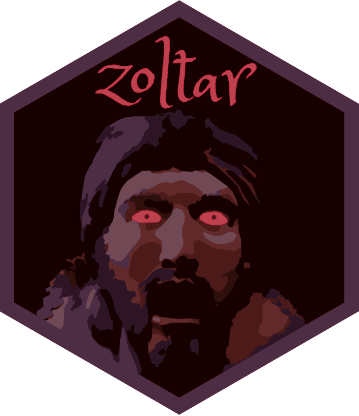

<!-- README.md is generated from README.Rmd. Please edit that file -->

```{r, include = FALSE}
knitr::opts_chunk$set(
  eval = FALSE,
  collapse = TRUE,
  comment = "#>",
  fig.path = "man/figures/README-",
  out.width = "100%"
)
```

```{r readme notes, include=FALSE}
# You'll still need to render `README.Rmd` regularly, to keep `README.md` up-to-date. `devtools::build_readme()` is handy for this. You could also use GitHub Actions to re-render `README.Rmd` every time you push. An example workflow can be found here: <https://github.com/r-lib/actions/tree/v1/examples>.
```

# klink {width=110px}

{width=216px}

## What it's for
The goal of klink is to provide helpful functions for Kellogg users to connect to common data sources and Connect processes.

```{r old badge, include=FALSE}
# <!-- badges: start -->
# <p align="center">
# 
# {width=120px}
# 
# </p>
# 
# <!-- badges: end -->
```

## Example

klink currently supports common SQL, Redshift, and Hadoop databases as well as S3 buckets and provides a more succinct approach to forming these connections:

```{r example, echo=TRUE}
# Old Approach to forming a SQL connection:
con <- DBI::dbConnect(
    odbc::odbc()
    ,Driver = "freetds"
    ,Server = "server"
    ,Database = "database_name"
    ,UID = "uid"
    ,PWD = "pwd"
    )

# New klink_sql Approach:
con <- klink_sql(environment = "DEV", database = "database_name")

```

In addition to the brevity of the klink syntax, end users also gain the benefit of not having to maintain credentials in their own code and individual publications.

## Setup
In order to use klink there are a few setup steps that will need to be completed:

1. Have a RStudio Connect account (you likely have one already if you're using RStudio Workbench, if not you can request access through Digital Concierge)
2. Create a local RStudio Connect API key <https://docs.rstudio.com/connect/user/api-keys>
3. Create an .Renviron file in your Home folder assigning your API key value to the name CONNECT_API_KEY <https://rstats.wtf/r-startup.html>
4. Install the klink package (instructions below)

## How to Install
Currently, the easiest way to install the klink package is to install from the public GitHub repo:
```{r install, eval=FALSE, include=TRUE}
devtools::install_github("mikechappelow/klink")

library(klink)
```

In the future we will host these types of packages in our internal RStudio Package Manager environment.


## Current Functions

### klink functions
The klink functions can be used to establish links to common data sources within Kellogg.

#### klink_sql
The klink_sql function enables users to connect to internal SQL databases. The function only requires* two arguments and removes the necessity of locally defining service account credentials in your code, .Renviron files, and Connect publications.

```{r klink_sql, include=TRUE}
library(klink)

conn <- klink_sql("DEV", "database_name") 
# note: there are optional arguments, including a server designation that can be used for connections outside of Keystone. See documentation for more details (?klink::klink_sql)

DBI::dbGetQuery(conn,
          "SELECT TOP 5
          var1, var2
          FROM table")
```

#### klink_redshift
The klink_redshift function enables users to link to predefined, internal redshift databases. The function currently only requires* one argument.

```{r klink_redshift, include=TRUE}
library(klink)

red_dev <- klink_redshift("DEV") 
# note: there are additional, optional arguments available. See documentation for more details (?klink::klink_redshift)

# Then use your connection as you would any other DBI connection object
DBI::dbGetQuery(red_dev, "SELECT DISTINCT tablename FROM PG_TABLE_DEF") 
DBI::dbGetQuery(red_dev, "SELECT TOP 10 * FROM fin_acctg_ops.fisc_cal_wk")
```

#### klink_hadoop
The klink_hadoop function enables users to link to predefined, internal hadoop databases. The function currently only requires* one argument.

```{r klink_hadoop, include=TRUE}
library(klink)

# hadoop_dev <- klink_hadoop("DEV", "KNA_BW") 
```
*Note:* Currently, you can only connect to Hadoop DEV from the UAT Workbench/Connect servers and PROD from the PROD Workbench/Connect servers.

#### klink_postgres
The klink_postgres function enables users to connect to kortex PostgreSQL databases.

```{r klink_postgres, include=TRUE}
library(klink)

conn <- klink_postgres("DEV", "postgres") 
```

#### klink_s3
The klink_s3 function enables users to link to our kortex s3 bucket simply by calling the function (no arguments required).

```{r klink_s3, include=TRUE}
library(klink)

# Retrieve required system settings (in background) and appropriate s3 bucket name
klink_s3()

# Use aws.s3 functions to retrieve information from s3 bucket
# (making sure to reference the bucket as "s3BucketName_kortex")
aws.s3::get_bucket_df(s3BucketName, max = 20)[["Key"]]
```


#### klink_s3R
The klink_s3R function enables users to link to our foreign s3 bucket simply by calling the function (no arguments required).

Example:

```{r klink_s3R, include=TRUE}
library(klink)

# Retrieve required system settings (in background) and appropriate s3 bucket name
klink_s3R()

# Use aws.s3 functions to retrieve information from s3 bucket
aws.s3::object_exists("your_object.rds", bucket = s3BucketName)
aws.s3::object_size("your_object.csv", bucket = s3BucketName)
```

#### klink_scrub
The klink_scrub function replaces NaN and Inf values (which often cause issues when writing to databases) with NAs (which are written as standard NULL values). Running klink_scrub on your data before attempting to write to a database is recommended as the error messages associated with these type of issues can often be nondescript and opaque.

Example:

```{r klink_scub, include=TRUE}
library(klink)

# Replace NaN and Inf values with NAs
my_df <- klink_scrub(my_df)

```

{width=216px}

### zoltar
The klink functions are wrappers that utilize zoltar in order to simplify the user experience. This is achieved by leveraging the zoltar API and making assumptions about the connection that should be formed based on the user inputs.

If you would like to avoid these assumptions while leveraging the underlying functionality you can do so by specifying your own connection settings and using the zoltar function directly in your connection call.

When a wish/alias of a known value is passed to this function our internal zoltar API returns the requested value. 

If there are required connections that are not yet supported by zoltar please reach out to the Kellogg Data Science team to have them added.

Example:
```{r zoltar, include=TRUE}
library(klink)

con <- DBI::dbConnect(
          odbc::odbc()
          ,Driver = "freetds"
          ,Server = zoltar("server_alias") 
          ,Database = "database_name"
          ,UID = zoltar("uid_alias")
          ,PWD = zoltar("pwd_alias")
          )
```

Note: the values passed to the zoltar function in the example above are not valid and are meant for illustrative purposes only. In order to retrieve a full list of currently supported arguments to the zoltar API users with a Connect API key can use the zoltar_list() function.

Example:
```{r zoltar_list, include=TRUE}
library(klink)

zoltar_list()
```


### bumper

The bumper function is intended to be called when you want to trigger an existing Connect job to run at the end of another process. This essentially allows you to string together a series of jobs in sequence without having to guess at/schedule specific run times.

Example:
```{r bumper, include=TRUE}
library(klink)

bumper(GUID = "b824db78-07b8-4205-b29e-0dbea32b4d8a", environment = "PROD")
```
Note: Currently only supported in PROD. Can be added to DEV if needed.
