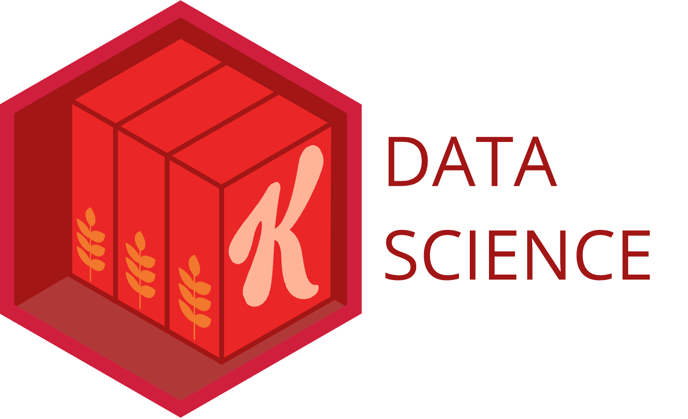

<!-- README.md is generated from README.Rmd. Please edit that file -->

```{r, include = FALSE}
knitr::opts_chunk$set(
  eval = FALSE,
  collapse = TRUE,
  comment = "#>",
  fig.path = "man/figures/README-",
  out.width = "100%"
)
```

```{r readme notes, include=FALSE}
# You'll still need to render `README.Rmd` regularly, to keep `README.md` up-to-date. `devtools::build_readme()` is handy for this. You could also use GitHub Actions to re-render `README.Rmd` every time you push. An example workflow can be found here: <https://github.com/r-lib/actions/tree/v1/examples>.
```

# klink {width=110px}

{width=216px}

## What it's for
The goal of klink is to provide helpful functions for Kellogg users to connect to common data sources.

```{r old badge, include=FALSE}
# <!-- badges: start -->
# <p align="center">
# 
# {width=120px}
# 
# </p>
# 
# <!-- badges: end -->
```

## Example

klink currently supports common SQL and Redshift databases as well as S3 buckets and provides a more succinct approach to forming these connections:

```{r example, echo=TRUE}
# Old Approach to forming a SQL connection:
con <- DBI::dbConnect(
    odbc::odbc()
    ,Driver = "freetds"
    ,Server = "server"
    ,Database = "database_name"
    ,UID = "uid"
    ,PWD = "pwd"
    )

# New klink_sql Approach:
con <- klink_sql(environment = "DEV", database = "database_name")

```

In addition to the brevity of the klink syntax, end users also gain the benefit of not having to maintain credentials in their own code and individual publications.

## Setup
In order to use klink there are a few setup steps that will need to be completed:

1. Have a RStudio Connect account (you likely have one already if you're using RStudio Workbench, if not you can request access through Digital Concierge)
2. Create a local RStudio Connect API key <https://docs.rstudio.com/connect/user/api-keys>
3. Create an .Renviron file in your Home folder assigning your API key value to the name CONNECT_API_KEY <https://rstats.wtf/r-startup.html>
4. Install the klink package (instructions below)

## How to Install
Currently, the easiest way to install the klink package is to install from the public GitHub repo:
```{r install, eval=FALSE, include=TRUE}
devtools::install_github("mikechappelow/klink")

library(klink)
```

In the future we will host these types of packages in our internal RStudio Package Manager environment.


## Current Functions

### klink functions
The klink functions can be used to establish links to common data sources within Kellogg.

#### klink_sql
The klink_sql function enables users to connect to internal SQL databases. The function only requires* two arguments and removes the necessity of locally defining service account credentials in your code, .Renviron files, and Connect publications.

```{r klink_sql, include=TRUE}
library(klink)

conn <- klink_sql("DEV", "database_name") 
# note: there is an optional server argument that can be used for connections outside of Keystone

DBI::dbGetQuery(conn,
          "SELECT TOP 5
          var1, var2
          FROM table")
```

Note: the klink_sql function also requires the odbc and DBI R packages (these should be automatically installed when you install klink).

#### klink_redshift
The klink_redshift function enables users to link to predefined, internal redshift databases. The function currenlty only requires* one argument and removes the necessity of locally defining service account credentials in your code, environ files, and Connect publications.

```{r klink_redshift, include=TRUE}
library(klink)

conn <- klink_redshift("DEV") 
# note: there is are optional database and server arguments that are currently optional and unused but may be utilized in the future

# Then use your connection as you would any other DBI connection object
DBI::dbListTables(conn)
DBI::dbGetQuery(conn, "SELECT TOP 10 * FROM fin_acctg_ops.fisc_cal_wk")
```

Or, If you need to be able to explore the database/table hiearchy, I would recommend using more direct calls to the zoltar API to form your connection for the time being (hope to incorporate this into the klink_redshift function in the future).

```{r zoltar_redshift, include=TRUE}
con <- DBI::dbConnect(odbc::odbc(),
                      Driver       = "redshift",
                      servername   = klink::zoltar("REDSHIFT_DEV_server"),
                      database     = "klg_nga_kna",
                      UID          = klink::zoltar("REDSHIFT_DEV_uid"),
                      PWD          = klink::zoltar("REDSHIFT_DEV_pwd"),
                      Port         = 5439)
```


#### klink_s3
The klink_s3 function enables users to link to our kortex s3 bucket simply by calling the function (no arguments required).

```{r klink_s3, include=TRUE}
# library(klink)
# 
# # Retrieve required system settings (in background) and appropriate s3 bucket name
# klink_s3()
# 
# # Use aws.s3 functions to retrieve information from s3 bucket
# # (making sure to reference the bucket as "s3BucketName_kortex")
# aws.s3::get_bucket_df(s3BucketName_kortex,max = 20)[["Key"]]
```


#### klink_s3R
The klink_s3R function enables users to link to our foreign s3 bucket simply by calling the function (no arguments required).

Example:

```{r klink_s3R, include=TRUE}
library(klink)

# Retrieve required system settings (in background) and appropriate s3 bucket name
klink_s3R()

# Use aws.s3 functions to retrieve information from s3 bucket
aws.s3::object_exists("your_object.rds", bucket = s3BucketName)
aws.s3::object_size("your_object.csv", bucket = s3BucketName)
```

Note: the klink_s3R function requires the aws.s3 package in order to use the resulting connection (these should be automatically installed when you install klink).

{width=216px}

### zoltar
The klink functions are wrappers that utilize zoltar in order to simplify the user experience. This is achieved by leveraging the zoltar API and making assumptions about the connection that should be formed based on the user inputs.

If you would like to avoid these assumptions while leveraging the underlying functionality you can do so by specifying your own connection settings and using the zoltar function directly in your connection call.

When a wish/alias of a known value is passed to this function our internal zoltar API returns the requested value. 

If there are required connections that are not yet supported by zoltar please reach out to the Kellogg Data Science team to have them added.

Example:
```{r zoltar, include=TRUE}
library(klink)

con <- DBI::dbConnect(
          odbc::odbc()
          ,Driver = "freetds"
          ,Server = zoltar("server_alias") 
          ,Database = "database_name"
          ,UID = zoltar("uid_alias")
          ,PWD = zoltar("pwd_alias")
          )
```

Note: the values passed to the zoltar function in the example above are not valid and are meant for illustrative purposes only. In order to retrieve a full list of currently supported arguments to the zoltar API users with a Connect API key can use the zoltar_list() function.

Example:
```{r zoltar_list, include=TRUE}
library(klink)

zoltar_list()
```
