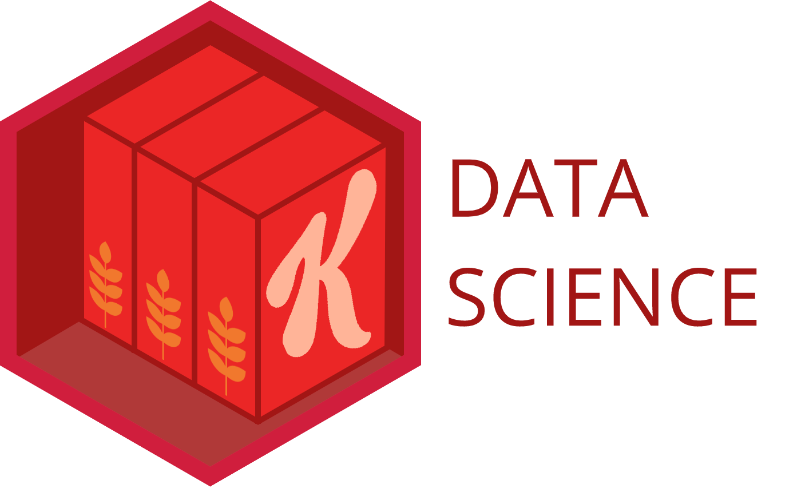

<!-- README.md is generated from README.Rmd. Please edit that file -->

# klink 

The goal of klink is to provide helpful functions for Kellogg users to
form connections to common data sources.

## Example

klink current covers commonly used SQL databases and non-Kortex S3 and
provides a more succinct approach to calling these connections:

``` r
# Old Approach to forming a SQL connection:
  con <- DBI::dbConnect(
    odbc::odbc()
    ,Driver = "freetds"
    ,Server = server
    ,Database = database
    ,UID = uid
    ,PWD = pwd
  )

# New klink Approach:
  con <- klink_sql("DEV", "database_name")
```

In addition to the brevity of the klink functions, end users also gain
the added benefit of not having to maintain credentials in their own
code and individual publications.

## Installation

You can install the development version of klink from
[GitHub](https://github.com/) with:

``` r
# install.packages("devtools")
devtools::install_github("mikechappelow/klink")
```

In the future we will host these types of packages in our internal
RStudio Package Manager environment.

## Setup

In order to use klink there is some one-time setup requirements:

1.  Have an RStudio Connect account (you likely have one already if
    you’re using RStudio Workbench, if not you can request access
    through Digital Concierge, instructions can be found here:
    <https://rstudioconnect.analytics.kellogg.com/RStudio_Knowledge_Library/>)
2.  Create a local RStudio Connect API key
    <https://docs.rstudio.com/connect/user/api-keys>
3.  Create an .Renviron file in your Home folder assigning your API key
    value to the name CONNECT_API_KEY
    <https://rstats.wtf/r-startup.html>

## Current Functions

### klink functions

The klink functions are a general group of functions used to establish
links to data sources commonly used within Kellogg.

#### klink_sql

The klink_sql function enables users to link to predefined, internal SQL
databases using only a couple of arguments and removes the necessity of
locally defining service account credentials in your code, .Renviron
files, and/or manually assignment in Connect publications.

``` r
library(klink)

conn <- klink_sql("DEV", "database")

DBI::dbGetQuery(conn,
          "SELECT TOP 5
          var1, var2
          FROM table")
```

#### klink_s3R

The klink_s3R function enables users to define all of the required
settings and variables required to link to our foreign s3 bucket simply
by calling the function.

``` r
library(klink)

# Retrieve required system settings (in background) and appropriate s3 bucket name
klink_s3R()

# Use aws.s3 functions to retrieve information from s3 bucket
aws.s3::object_exists("your_object.rds", bucket = s3BucketName)
aws.s3::object_size("your_object.csv", bucket = s3BucketName)
```

#### zoltar

The klink functions are essentially wrappers that utilize zoltar to make
the user experience as lightweight as possible by making implicit
assumptions about the connection that should be formed.

If you would like to override these assumptions by specifying your own
connection settings zoltar is the solution.

When a wish/alias of a known value is passed to this function our
internal zoltar API returns the requested value.

If there are required connections that are not yet supported by zoltar
please reach out to the Kellogg Data Science team to have them added.

``` r
library(klink)
zoltar("s3BucketName")
```
